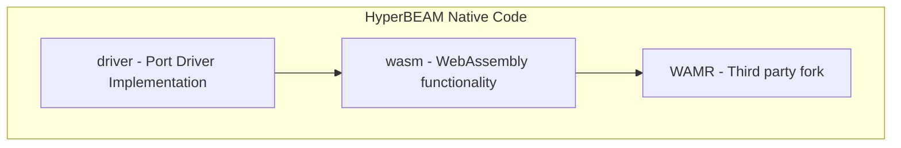

# hb_beamr

This directory contains the native code for the `hb_beamr` Erlang port driver. The code is split into two sub-projects: `wasm` and `driver`.

## Sub-projects

### 1. wasm

This sub-project contains code related to running the WebAssembly runtime. Currently uses a fork of WAMR, and is built using CMake. This project is designed to be testable indepently from the erlang driver.

### 2. driver

This sub-projects contains the actual Erlang port driver implementation, and the integration with the `wasm` subproject. The port driver built is managed by rebar3.

## Dependency graph

