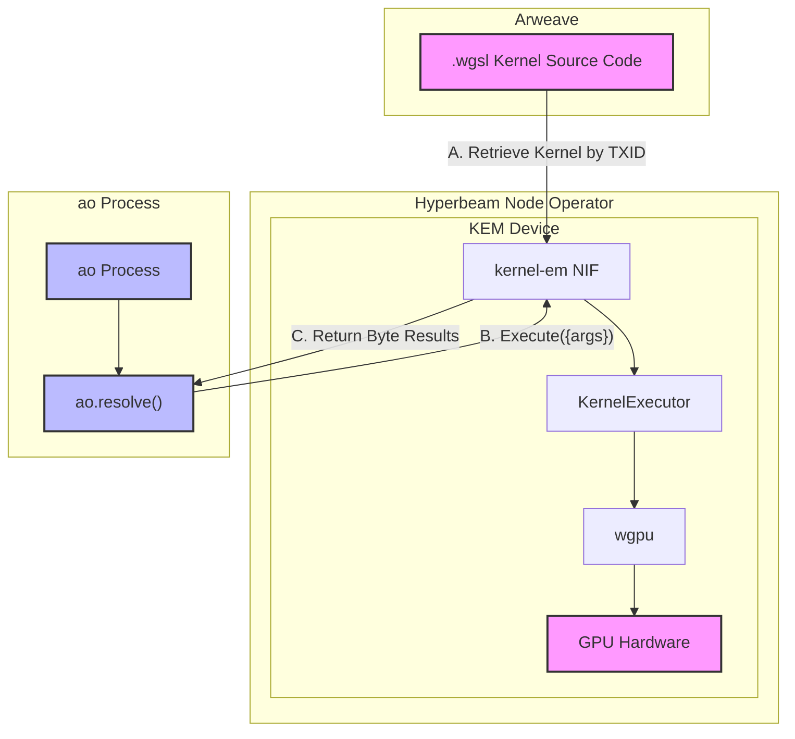

## About

The `kernel-em` NIF (kernel execution machine - `kem@1.0` device) is a HyperBEAM Rust device built on top of [wgpu](https://github.com/gfx-rs/wgpu) to offer a general GPU-instructions compute execution machine for `.wgsl` functions (shaders, kernels).

With `wgpu` being a cross-platform GPU graphics API, hyperbeam node operators can add the KEM device to offer a compute platform for KEM functions. And with the ability to be called from within an ao process through `ao.resolve` (`kem@1.0` device), KEM functions offer great flexibility to run as GPU compute sidecars alongside ao processes.


## KEM Technical Architecture

KEM function source code is deployed on Arweave (example, double integer: [btSvNclyu2me_zGh4X9ULVRZqwze9l2DpkcVHcLw9Eg](https://arweave.net/btSvNclyu2me_zGh4X9ULVRZqwze9l2DpkcVHcLw9Eg)), and the source code TXID is used as the KEM function ID.

```rust
fn execute_kernel(
    kernel_id: String,
    input_data: rustler::Binary,
    output_size_hint: u64,
) -> NifResult<Vec<u8>> {
    let kernel_src = retrieve_kernel_src(&kernel_id).unwrap();
    let kem = pollster::block_on(KernelExecutor::new());
    let result = kem.execute_kernel_default(&kernel_src, input_data.as_slice(), Some(output_size_hint));
    Ok(result)
}
```

A KEM function execution takes 3 parameters: function ID, binary input data, and output size hint ratio (e.g., `2` means the output is expected to be no more than 2x the size of the input).

The KEM takes the input, retrieves the kernel source code from Arweave, and executes the GPU instructions on the hyperbeam node operator's hardware against the given input, then returns the byte results.



## On Writing Kernel Functions
As the kernel execution machine (KEM) is designed to have I/O as bytes, and having the shader entrypoint standardized as `main`, writing a kernel function should have the function's entrypoint named `main`, the shader's type to be `@compute`, and the function's input/output should be in bytes; here is an example of skeleton function:

```wgsl
// SPDX-License-Identifier: GPL-3.0

// input as u32 array
@group(0) @binding(0)
var<storage, read> input_bytes: array<u32>;

// output as u32 array
@group(0) @binding(1)
var<storage, read_write> output_bytes: array<u32>;

// a work group of 256 threads
@compute @workgroup_size(256)
// main compute kernel entry point
fn main(@builtin(global_invocation_id) global_id: vec3<u32>) {
}
```

## References

* hb device interface: [dev_kem.erl](../../src/dev_kem.erl)
* nif tests: [kem_nif_test.erl](../../src/kem_nif_test.erl)
* ao process example: [kem-device.lua](../../test/kem-device.lua)

## License
This repository is licensed under the [MIT License](./LICENSE)