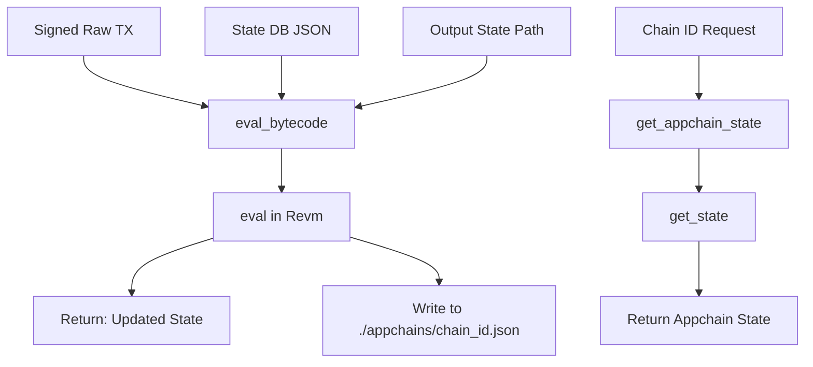

## About

The `load_revm_nif` is the base of the `@evm1.0` device: an EVM bytecode emulator built on top of Revm (version [v22.0.1](https://github.com/bluealloy/revm/releases/tag/v69))

The device not only allow bytecode (signed raw transaction) evaluation against a given state db, but also appchains creation, its statefulness, EVM context customization (gas limit, chain id, contract size limit, etc), and the elimination of the block gas limit, and substituing it with tx gas limit. 

***[!] This device is experimental, in PoC stage [!]***

* Live demo at [ultraviolet.load.network](ultraviolet.load.network)


## EVM Device Technical Architecture

```rust
#[rustler::nif]
fn eval_bytecode(signed_raw_tx: String, state: String, cout_state_path: String) -> NifResult<String> {
    let state_option = if state.is_empty() { None } else { Some(state) };
    let evaluated_state: (String, String) = eval(signed_raw_tx, state_option, cout_state_path)?;
    Ok(evaluated_state.0)
}

#[rustler::nif]
fn get_appchain_state(chain_id: &str) -> NifResult<String> {
	let state = get_state(chain_id);
    Ok(state)
}
```

`eval_bytecode()` takes 3 inputs, a signed raw transaction (N.B: chain id matters), a JSON-stringified state db and the output state path (here in this device it's in [./appchains](./appchains/))





## References

* hb device interface: [dev_evm.erl](../../src/dev_evm.erl)
* nif tests: [load_revm_nif_test.erl](../../src/load_revm_nif_test.erl)
* ao process example: [evm-device.lua](../../test/evm-device.lua)

## License
This repository is licensed under the [MIT License](./LICENSE)